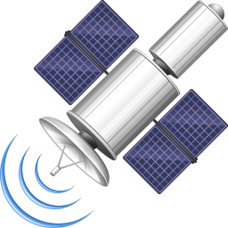

# QCCTV

QCCTV allows you to use your devices (computers, mobile phones, tablets, etc.) to implement a CCTV network in your LAN.

Besides security, QCCTV can have many uses, such as recording a video with multiple cameras at once or tell if your cat is plotting to kill you.

The QCCTV suite consists of two applications:
- **QCCTV Camera**, which streams your camera's live images to the LAN
- **QCCTV Station**, which receives camera streams from the LAN and manages each camera individually

### How QCCTV works

- QCCTV Cameras broadcast data using UDP to make themselves visible to any QCCTV Station running on the LAN
- When the QCCTV Station receives a broadcast datagram from a camera, it attempts to establish a TCP connection with the camera
- If the connection is established, then the camera will send *stream* packets periodically, which contain the following data:
    - CRC32 checksum
    - Camera status byte
    - Camera name
    - Flashlight status
    - Camera FPS value
    - Compressed JPEG image
- On the other hand, the QCCTV station will send *command* packets every 500 milliseconds, these packets contain the following data:
    - Desired camera FPS
    - Flashlight status request (e.g. to remotely turn on or off the flashlight)
    - A focus request (e.g. to force the camera to focus on an objective)

If the QCCTV station does not receive a stream packet in more than 2-5 seconds, then it will asume that the camera is dead and will re-establish the connection with the camera as soon as it receives another broadcast datagram from the camera.

### Icons 

The icons come from the "Global Security" icon set from Aha-Soft and are released under the Creative Commons license.

You can download the icon set from [http://aha-soft.com](http://www.aha-soft.com/free-icons/free-global-security-icons/)

### License

The QCCTV software suite is released under the MIT license.
